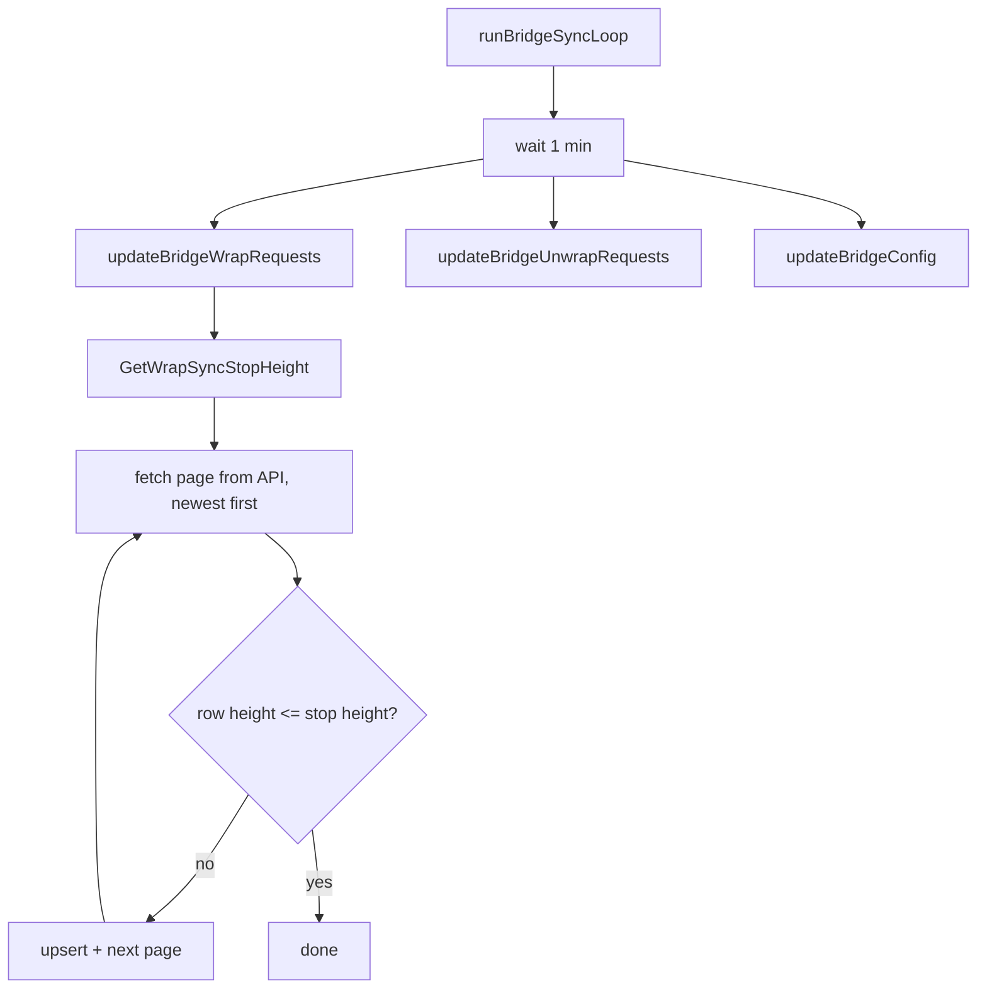

# Bridge sync

The bridge sync goroutine refreshes three categories of data on a
1-minute cadence:

1. Wrap token requests (Zenon → external chain).
2. Unwrap token requests (external chain → Zenon).
3. Bridge configuration (admin, guardians, orchestrator/security info,
   networks + token pairs).

Implementation: `runBridgeSyncLoop` and `syncBridgeData` in
[`internal/indexer/indexer.go`](https://github.com/0x3639/nom-indexer-go/blob/main/internal/indexer/indexer.go).

## Why 1 minute?

Wrap/unwrap requests have user-visible latency targets — an explorer
showing "your wrap is pending" should reflect chain state within a
minute. The RPC cost is modest (a couple of paginated calls per tick),
and the work is independent of the momentum sync loop's cadence.

The bridge sync runs on its own goroutine so a slow node response
never blocks momentum processing.

## Newest-first paging with a stop height

Both wrap and unwrap syncs use the same paging strategy:

1. Ask the DB: what's the **oldest unfinalized** TX height we know
   about? That's the `stop_height`. If everything is finalized, fall
   back to the newest known height. If the table is empty, start at 0
   (full sync).
2. Page the API newest-first.
3. Upsert each row.
4. Stop once we cross the stop height.

This minimizes RPC calls. After the first full sync, the per-tick
cost drops to "fetch one page or two" rather than re-walking the
entire request history.

## Wrap vs unwrap differences

Wraps finalize sequentially (one orchestrator signs, then the next),
so an unfinalized wrap "ages out" once enough confirmations
accumulate. The `confirmations_to_finality > 0` predicate identifies
pending rows.

Unwraps finalize **user-initiated and out of order** — a user can
sit on a redeem indefinitely. Pending rows are identified by
`NOT redeemed AND NOT revoked`. The sync must keep refreshing
already-known rows because the user could redeem at any time.

`UpsertWrapRequest` on conflict only touches `signature` and
`confirmations_to_finality`. `UpsertUnwrapRequest` on conflict
touches `signature`, `redeemed`, `revoked`, `redeemable_in`.

## Bridge config refresh

In addition to wraps + unwraps, every tick calls:

| API call | Writes |
|---|---|
| `GetBridgeInfo` | [`bridge_admin`](../schema/bridge_admin.md) singleton row. |
| `GetSecurityInfo` | [`bridge_security_info`](../schema/bridge_security_info.md) singleton + [`bridge_guardians`](../schema/bridge_guardians.md) (with the absent-marking sweep). |
| `GetOrchestratorInfo` | [`bridge_orchestrator_info`](../schema/bridge_orchestrator_info.md) singleton. |
| `GetAllNetworks` (paginated) | [`bridge_networks`](../schema/bridge_networks.md) + nested [`bridge_network_tokens`](../schema/bridge_network_tokens.md). |

The guardian absent-marking is the only non-trivial logic: any
guardian whose `last_updated_timestamp` is older than the current
tick (i.e., wasn't returned by `GetSecurityInfo` this time) is
flipped to `nominated = false AND accepted = false`. That's how a
removed guardian is recorded; rows are never deleted.

## Error handling

Each sub-step is wrapped in its own error check; a failure logs and
the next sub-step continues. A failed wrap-request fetch doesn't
block the config refresh, and vice versa.

The "unknown network" warning on unwrap fetches is the known
test-net quirk; see
[`docs/operations/failure-modes.md`](../operations/failure-modes.md).

## Stop heights — the helpers

In
[`internal/repository/bridge.go`](https://github.com/0x3639/nom-indexer-go/blob/main/internal/repository/bridge.go):

- `GetWrapSyncStopHeight` — `MIN(creation_momentum_height)` where
  `confirmations_to_finality > 0`, else `MAX(creation_momentum_height)`,
  else `0`.
- `GetUnwrapSyncStopHeight` — `MIN(registration_momentum_height)` where
  `NOT redeemed AND NOT revoked`, else `MAX(registration_momentum_height)`,
  else `0`.

Both are read-mostly and run once per tick.

## What happens if the bridge sync stops

The sync goroutine logs a warning on each failed tick and moves on.
`bridge_admin.last_updated_timestamp` ages without being refreshed
— that's the operator's signal that the sync is broken. See
[`docs/operations/monitoring.md`](../operations/monitoring.md).

Even if the bridge sync is wedged indefinitely, the main momentum
sync continues — bridge data is auxiliary to the ledger. The bridge
sync goroutine is independent.
