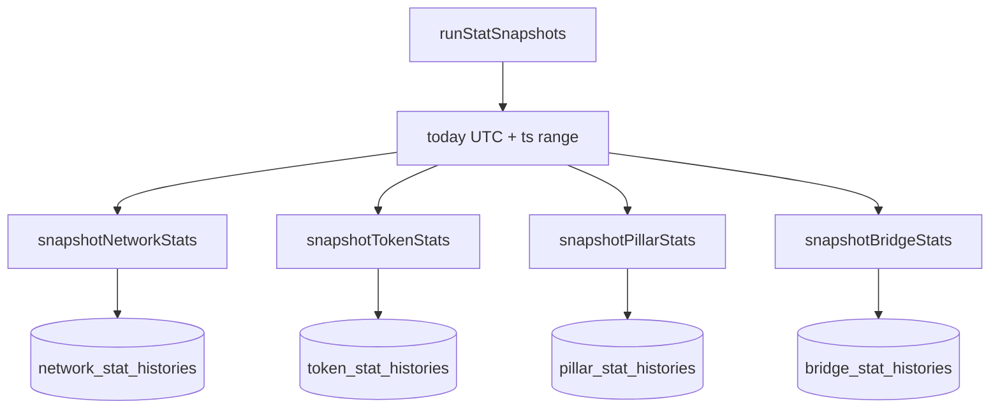

# Cron loops and daily snapshots

The cron goroutine in
[`internal/indexer/cron.go`](https://github.com/0x3639/nom-indexer-go/blob/main/internal/indexer/cron.go)
runs three independent tickers: voting activity, token holder counts,
and the 1-hour daily-stat snapshot. All three run once at startup so
dashboards have data immediately.

## Loop structure

```go
func (i *Indexer) runCronLoop(ctx, votingInt, holdersInt time.Duration) {
    statsInt := time.Hour

    i.runVotingActivity(ctx)     // startup
    i.runTokenHolderCounts(ctx)
    i.runStatSnapshots(ctx)

    votingT := time.NewTicker(votingInt);   defer votingT.Stop()
    holdersT := time.NewTicker(holdersInt); defer holdersT.Stop()
    statsT := time.NewTicker(statsInt);     defer statsT.Stop()

    for {
        select {
        case <-ctx.Done():            return
        case <-votingT.C:             i.runVotingActivity(ctx)
        case <-holdersT.C:            i.runTokenHolderCounts(ctx)
        case <-statsT.C:              i.runStatSnapshots(ctx)
        }
    }
}
```

A single goroutine drives all three; the `select` keeps them
independent. When one job is running, the other tickers may fire and
queue events; the queued event is picked up on the next iteration.

## `runVotingActivity`

For every cached pillar, computes
`distinct proposals voted on / proposals eligible since spawn` and
writes it to `pillars.voting_activity`. Cheap — pure SQL against
`votes`, `projects`, `project_phases`, and `pillar_updates`.

Configured by `cron.voting_activity_interval` (default 10 min).

## `runTokenHolderCounts`

For every row in `tokens`, runs
`SELECT COUNT(*) FROM balances WHERE token_standard = $1 AND
balance > 0` (partial index) and updates `tokens.holder_count`. Fast;
~200ms for 328 tokens on a healthy DB.

Configured by `cron.token_holders_interval` (default 10 min).

## `runStatSnapshots`

The daily snapshot job. Runs four sub-jobs against the same UTC date
bucket. Each upserts into its `*_stat_histories` table with
`ON CONFLICT (date, …) DO UPDATE`. Running mid-day rewrites the
current day's row with fresher numbers.



Sub-jobs are run sequentially; one failure logs a warning and the
others still run.

### snapshotNetworkStats

One row per UTC date. A single SELECT computes:

- `total_tx`, `daily_tx` from `momentums.tx_count` (all-time + today).
- `total_addresses`, `daily_addresses`, `active_addresses` from
  `accounts.first_active_at` / `last_active_at`.
- `total_tokens`, `total_stakes`, `daily_stakes`, `total_fusions`,
  `daily_fusions`, `total_pillars`, `total_sentinels`.

`daily_tokens` is currently `0` — `tokens` has no creation timestamp
yet.

### snapshotTokenStats

For each token, computes `daily_minted` + `daily_burned` via
`TokenEventRepository.SumDailyMintsBurns`, carries `total_supply`,
`holder_count`, `transaction_count` from the live `tokens` row.

### snapshotPillarStats

For each cached pillar, writes `rank`, `weight`, `total_delegators`
(from `delegations` history). `momentum_rewards` and
`delegate_rewards` are reserved but not populated — wiring them in
needs a join through `reward_transactions` × `delegations` that
hasn't been written yet.

### snapshotBridgeStats

Two GROUP BY queries against `wrap_token_requests` and
`unwrap_token_requests`, joining through the momentum's timestamp.
Yields one row per (date, network_class, chain_id, token_standard)
that had activity that day.

## Date bucketing

All snapshot queries use the same UTC bucket:

```go
today := time.Now().UTC().Format("2006-01-02")
todayStart, _ := time.Parse("2006-01-02", today)
startTs := todayStart.Unix()
endTs := startTs + 86400
```

`startTs <= momentum_timestamp < endTs` is the canonical filter. The
generated SQL is in [`schema/conventions.md`](../schema/conventions.md#timestamps).

## What's hardcoded vs. tunable

| Loop | Hardcoded |
|---|---|
| Voting activity | No — `cron.voting_activity_interval`. |
| Token holders | No — `cron.token_holders_interval`. |
| Daily snapshots | Yes — 1 hour. |

See [`docs/config/cron-intervals.md`](../config/cron-intervals.md) for
the reasoning behind each.
