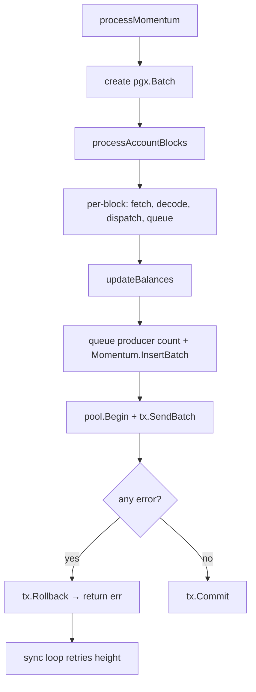

# Data flow — momentum to row

A line-by-line trace of what happens between "the node tells us a new
momentum exists" and "the rows are committed". The function is
`Indexer.processMomentum` in
[`internal/indexer/processor.go`](https://github.com/0x3639/nom-indexer-go/blob/main/internal/indexer/processor.go).

## Inputs

`processMomentum(ctx, m *api.Momentum)` is invoked from one of:

- The subscription loop's `runSubscriptionLoop` once a fresh momentum
  arrives.
- The catch-up sync's `sync()` while iterating
  `GetMomentumsByHeight(start, 100)`.
- The backfill (`Indexer.Backfill` or `cmd/backfill`) iterating
  missing heights.

The momentum carries its `Hash`, `Height`, `TimestampUnix`, `Producer`,
and a `Content` slice of `api.AccountHeader` (each header has a `Hash`
that we need to follow up on).

## Step 1 — build a batch

```go
batch := &pgx.Batch{}
```

`processMomentum` queues every per-momentum write into this batch. The
transaction is opened later, immediately before `SendBatch`, so the
indexer does not hold a database transaction open while it performs RPC
reads from the node.

## Step 2 — process account blocks

`processAccountBlocks(ctx, batch, m)` loops `m.Content`:

```go
for _, header := range m.Content {
    block := getAccountBlockByHash(header.Hash)   // RPC
    txData := tryDecodeTxData(block)              // ABI decode
    // ... per-block work ...
}
```

For each block:

1. **Fetch full data.** `LedgerApi.GetAccountBlockByHash(header.Hash)`.
2. **Decode call data.** `tryDecodeTxData` in
   [`decoder.go`](https://github.com/0x3639/nom-indexer-go/blob/main/internal/indexer/decoder.go)
   tries the Common ABI first, then the contract-specific ABI matching
   `ToAddress`. Result: a `TxData{Method, Inputs}`.
3. **Enrich pillar inputs.** For pillar-target blocks with
   methods that take a `name`, inject `pillarOwner` resolved from the
   cached `pillarNameToOwner` map.
4. **Upsert the account row.** `accounts.address`, `block_count`, and
   `public_key` come from the block; flow + activity columns are
   handled in step 6.
5. **Insert the account_block.** Through
   `AccountBlockRepository.InsertBatch`. The decoded `Method` and
   `Inputs` go into the JSONB column after sanitization
   (NUL byte + literal ` ` removal).
6. **Track ZNN/QSR flow + activity.**
   `AddSendBatch` / `AddReceiveBatch` increment the right `znn_*` or
   `qsr_*` column and bump `first_active_at` (MIN) / `last_active_at`
   (MAX). At `m.Height == 1`, `SetGenesisBalanceBatch` records the
   genesis seed.
7. **Update paired + descendant references.** Two follow-up `UPDATE`
   queries fix up `account_blocks.paired_account_block` and
   `descendant_of` for previously-inserted rows.
8. **Dispatch to a contract handler.** If the block is a
   ContractReceive on an embedded contract,
   `indexEmbeddedContracts(ctx, batch, block, txData, m)` routes by
   `block.Address.String()` into a per-contract handler. See
   [`docs/indexing/`](../indexing/index.md).
9. **Detect reward receives.** If the block is a UserReceive paired
   with either the liquidity treasury or an embedded reward contract,
   `indexLiquidityReward` / `indexReceivedReward` queues a
   `reward_transactions` row and a `cumulative_rewards` update. See
   [`docs/indexing/rewards.md`](../indexing/rewards.md).
10. **Handle `TokenInfo`.** If `block.TokenInfo` is non-nil, upsert
    the `tokens` row (Issue / token metadata refresh).

## Step 3 — refresh balances

```go
if m.Height > 1 && len(m.Content) < genesisBalanceUpdateThreshold {
    updateBalances(ctx, batch, m.Content, int64(m.TimestampUnix))
}
```

For each touched address, fetch its `AccountInfo` and upsert
`balances` rows. Skipped for momentums with ≥1000 account blocks
(genesis) — see
[`schema/balances.md`](../schema/balances.md).

## Step 4 — queue producer + momentum rows

After the account-block work, the indexer resolves the momentum
producer to a pillar owner/name. If a pillar owner is known,
`PillarRepository.IncrementMomentumCountBatch` queues the
`produced_momentum_count` increment. Then `MomentumRepository.InsertBatch`
adds the parent `momentums` row at the end of the batch. The momentum
insert is idempotent via `ON CONFLICT (height) DO NOTHING`.

## Step 5 — open the transaction, send the batch, commit

```go
tx, err := i.pool.Begin(ctx)
results := tx.SendBatch(ctx, batch)
for i := 0; i < batch.Len(); i++ {
    if _, err := results.Exec(); err != nil {
        batchErr = err   // first error wins; iterate to drain
    }
}
results.Close()
if batchErr != nil {
    tx.Rollback(ctx)
    return batchErr
}
tx.Commit(ctx)
```

The batch runs each queued write against the open transaction. If any
op returns an error, the entire transaction rolls back — no partial
writes. The sync loop retries on error.

The "first error wins" pattern means the failing op's error is
returned, not the last; all remaining ops are still `Exec`'d to drain
the batch results pipe (otherwise we'd leak a partially-drained pipe
back into the pool).

## Diagram



## What's *not* in the per-momentum flow

These run on independent goroutines and don't share the per-momentum
transaction:

- Bridge sync ([`bridge-sync.md`](bridge-sync.md)).
- Cached data sync (pillars, sentinels, projects every 5 min).
- Cron jobs ([`cron-and-snapshots.md`](cron-and-snapshots.md)).

They share the connection pool but have their own (mostly single-statement)
transactions.

## Performance characteristics

- **Per-momentum wall time:** typically 5–50 ms on a local Postgres
  with a healthy remote node; longer when `updateBalances` hits a
  fresh address (extra RPC round-trip).
- **Throughput during catch-up sync:** ~40–60 momentums/sec.
- **Bottleneck:** node round-trips. A local node + Postgres is ~5×
  faster than a remote node.
