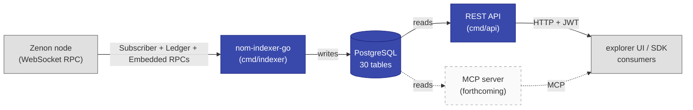
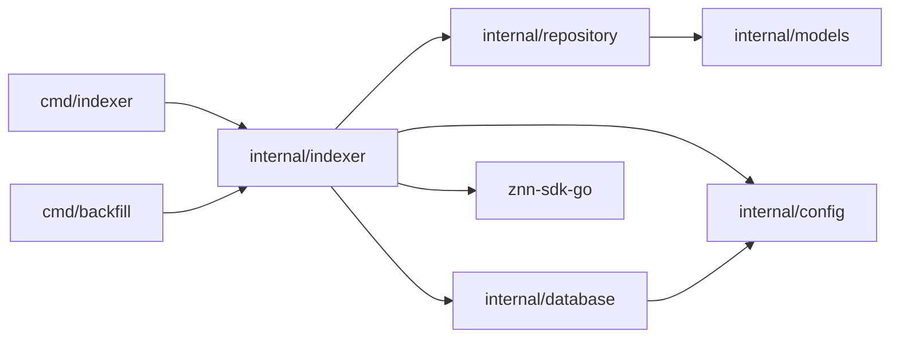
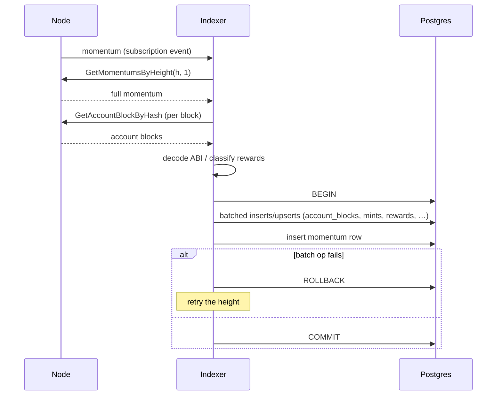

# Architecture overview

The big picture: one indexer process, one read-only HTTP API
process, one Postgres database, several independent work lanes, and
one future consumer surface (MCP).

## System context

- The REST API server lives at `cmd/api` with HS256 JWT auth and
  Prometheus `/metrics` on a sidecar port. See [API](../api/index.md).
- The MCP server (dashed) is still future work; it will live at
  `cmd/mcp` and share `internal/api/dto` + `internal/repository`
  with the REST API.

## Process layout

One Go process. Inside, the foreground sync/subscription loop and three
managed background loops share the same pgx connection pool; the SDK
also manages its own connection lifecycle:

| # | Lane | Cadence | Responsibility |
|---|---|---|---|
| 1 | Main sync / subscription | reactive | Initial catch-up, then real-time momentum subscription with auto-reconnect. Runs in the foreground of `Indexer.Run`. |
| 2 | Bridge sync | 1 min | Wrap + unwrap requests, bridge config (networks, admin, guardians, orchestrator/security). |
| 3 | Cached data sync | 5 min | Pillars, sentinels, accelerator projects + phases. |
| 4 | Cron loop | 10 min / 1 hr | Voting activity, token holder counts, daily stat snapshots. |
| 5 | SDK connection | reactive | Owned by the SDK; calls back into (1) on reconnect. |

The main sync lane is the only one that processes momentums — the
others are independent maintenance lanes.

A `WaitGroup` in `Indexer.Run` makes shutdown wait for the three
managed goroutines (bridge, cached data, cron) before returning. The
sync goroutine is the foreground; it returns when ctx is cancelled or
sync fails terminally.

## Package layout

See [`docs/development/project-layout.md`](../development/project-layout.md)
for the full tree. The dependency graph:

`internal/models` is the leaf — it imports stdlib only. That makes
it safe for the future API and MCP packages to depend on (they'll need
the structs to serialize responses).

## Data flow at a glance

The whole flow for one momentum lives in
[`internal/indexer/processor.go`](https://github.com/0x3639/nom-indexer-go/blob/main/internal/indexer/processor.go).
See [`data-flow.md`](data-flow.md) for the line-by-line trace.

## Configuration sources

Resolution order (later wins):

1. Hard-coded defaults.
2. `config.yaml` (project root or `/app/config.yaml`).
3. Environment variables.
4. Per-call options (none today).

Validation runs at startup; the binary exits non-zero on invalid
config. See [`docs/config/reference.md`](../config/reference.md).

## Error and retry strategy

- **Transient RPC + DB errors** are retried with exponential backoff
  inside `withRetry`
  ([`internal/indexer/retry.go`](https://github.com/0x3639/nom-indexer-go/blob/main/internal/indexer/retry.go)).
  Default: 6 attempts, 0.5s → 30s backoff, cancellable via ctx.
- **Per-momentum batch failures** roll back the whole momentum and the
  sync loop retries on the next pass. Idempotent inserts (`ON CONFLICT
  DO NOTHING` or `DO UPDATE`) make retries safe.
- **Cached-data sync failures** are non-fatal — the loop logs and
  tries again on the next tick.
- **Subscription channel close** triggers a catch-up sync followed by
  a fresh subscription.

## What's the contract?

The Postgres schema. Read [`docs/schema/index.md`](../schema/index.md)
first; everything else in this repo serves the schema.
