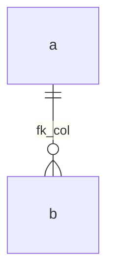

# Authoring docs

The doc site is mkdocs-material with plain Markdown source. Anyone
editing `docs/` should be able to preview locally and pass the strict
build before submitting a PR.

## One-time setup

```bash
# Create a Python venv for the docs (PEP 668 hosts need this).
python3 -m venv .venv-docs
.venv-docs/bin/pip install --quiet \
  mkdocs-material mkdocs-mermaid2-plugin \
  mkdocs-include-markdown-plugin mkdocs-swagger-ui-tag \
  pymdown-extensions pyyaml
```

## Live preview

```bash
.venv-docs/bin/mkdocs serve
# Open http://127.0.0.1:8000
```

Edits to `docs/`, `mkdocs.yml`, the README, etc. trigger an automatic
rebuild + reload.

## Strict build

What CI runs. Catches broken links, missing pages, malformed
front-matter, etc.

```bash
.venv-docs/bin/mkdocs build --strict
```

Must pass before merging.

## Regenerate the LLM indexes

`llms.txt` (index) and `llms-full.txt` (full corpus) are checked into
the repo. The docs workflows regenerate them while building the
published site, and PRs need the committed copies in sync:

```bash
.venv-docs/bin/python scripts/docs/gen-llms-txt.py
.venv-docs/bin/python scripts/docs/gen-llms-full.py
```

To verify CI will pass:

```bash
.venv-docs/bin/python scripts/docs/gen-llms-txt.py --check
.venv-docs/bin/python scripts/docs/gen-llms-full.py --check
```

The `--check` flags exit non-zero if the on-disk file would differ
from a fresh regeneration.

## Templates

Two fixed templates apply repo-wide so LLMs and tooling can parse
content mechanically.

### Per-table schema page (`docs/schema/<table>.md`)

```markdown
---
title: <table>
---

# `<table>`

## Purpose
<one paragraph>

## Columns
<table: name, type, NULL, default, notes>

## Primary key & indexes
<list>

## Relations
<list>

## Write path
<which function writes; link to internal/…>

## Read patterns
<typical queries>

## Gotchas
<table-specific quirks>
```

Embed shared caveats with the `include-markdown` plugin:

```markdown
| `amount` | `BIGINT` | NO | — | int64 cap applies.  |
```

The three available fragments live in `docs/schema/fragments/`.

### Per-contract indexing page (`docs/indexing/<contract>-contract.md`)

```markdown
---
title: <Contract>
---

# <Contract> contract

## Contract address
<constant + link to internal/models/constants.go>

## Methods observed
<table: method, inputs, triggers>

## Per-method write effects
<bulleted list per method>

## Special computation
<cancel_id / voting_id / etc.>

## Tests
<links to relevant _test.go files>
```

## Mermaid diagrams

Fenced code blocks with `mermaid` render via the mermaid2 plugin:

```` markdown

````

GitHub also renders these natively, so they look right in the
repo browser too.

## Admonitions

`pymdownx` admonitions render as styled callouts:

```markdown
!!! warning "Title"
    Body text.

!!! note
    Body without a custom title.
```

Types: `note`, `warning`, `info`, `tip`, `danger`, `example`.

## Linking

Use repo-relative paths for code, doc-relative paths for docs:

```markdown
- [`internal/indexer/processor.go`](https://github.com/0x3639/nom-indexer-go/blob/main/internal/indexer/processor.go) — full URL for code references.
- [`schema/conventions.md`](../schema/conventions.md) — doc-relative for sibling docs.
```

## Style

- One H1 per page, matching the front-matter `title`.
- Sentence-case headings.
- No emoji unless mirroring an upstream label.
- Keep lines ≤ ~88 chars when practical — easier to PR-review.
