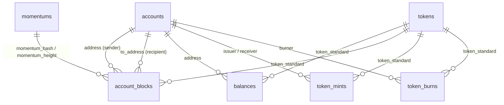
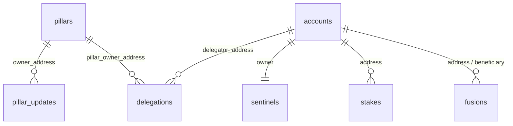
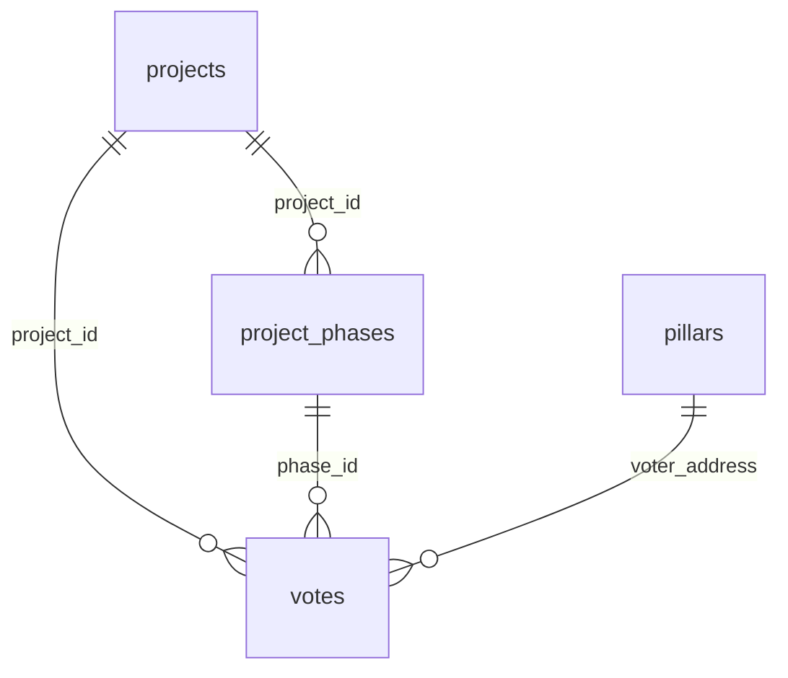
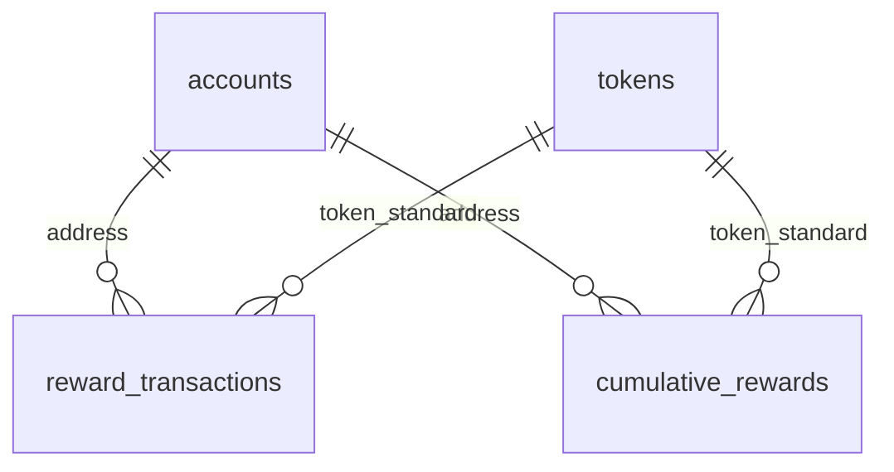
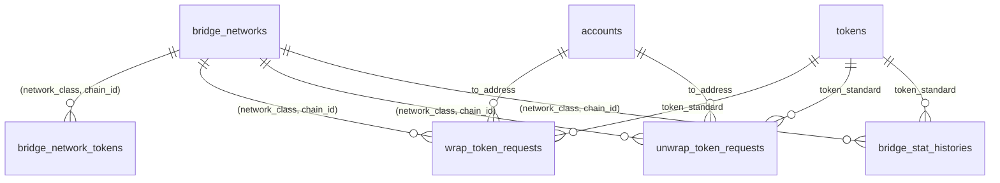

# Entity relationship diagram

Relations are by convention only — the schema declares **no** foreign-key
constraints. The diagram below shows logical join paths, not enforced
referential integrity. See [conventions](conventions.md#foreign-keys) for
the reasoning.

## Core ledger

## Pillars, sentinels, stakes, plasma

## Accelerator-Z

## Rewards

## Bridge

## Singleton bridge tables

`bridge_admin`, `bridge_orchestrator_info`, and `bridge_security_info` each
hold exactly one row (`row_id = 1`); they have no incoming references.
`bridge_guardians` is a flat list keyed by address.

## Daily snapshots

`network_stat_histories`, `token_stat_histories`, `pillar_stat_histories`,
and `bridge_stat_histories` are append-on-day-bucketed rollups. Their
relationships to the source tables are date-scoped aggregations, not
row-level joins; see the [cron and snapshots](../architecture/cron-and-snapshots.md)
page for the aggregation queries.
